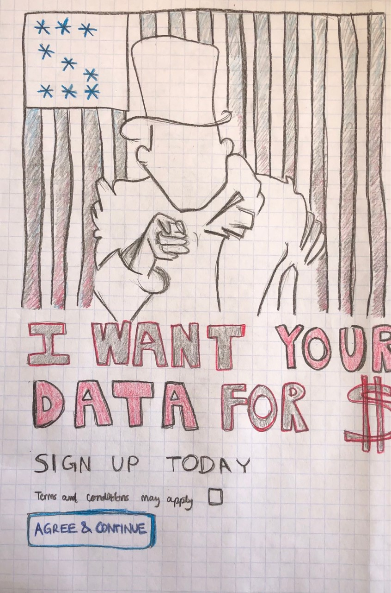
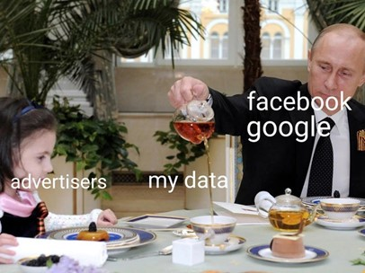

## ~ Preface and Thoughts ~

```markdown

Throughout this course I have reflected on the idea of conveying “truth” through language. 
I recall one of my favorite texts from the course -- James Agee’s interpretation of
Walker Evans’s photos in Let Us Now Praise Famous Men. From this reading, I realized that
there is no singular truth or singular, “correct’ interpretation of reality. This is 
not a bad thing. In fact, we need to have multiple interpretations of reality to shock
audiences into action, by exposing them to realities that they have not yet experienced.

Language does not have to be confined to words on paper, and the way we use language to
spur social change can manifest through many different mediums. Shocking someone into
action does not have to involve a bombardment of internet messages or advertisements.
It can be as simple as a memoir on cancer. It can look like a graphic novel. It can
look like a puppet. In the end, the ultimate goal of a body of language that invokes 
social change is to assume a poetic form: presenting what is taken for granted as “common” 
through an unfamiliar lens, which inspires the masses to commit to action. The goal of 
writing in social change is not only to change thought and action, but to induce a 
consciousness in the way of thinking and acting. 

With the pieces I have woven together in this portfolio, I hope to encourage a reflection 
on our subsistence in the digital age. How have our devices rendered our intimicay with the
world and with each other, artificial? How can we break away from the confines of this 
modern, digital prison? 
```


--------------------------------------------------------------------------------------------------------------------------------------------------------------------------------
## A Protest For Privacy



```markdown
Process Notes:

I decided to create a political poster about loss of privacy and “digital confinement” 
that parodies the Uncle Sam “I want you for U.S. army” propaganda poster. I wanted to
parallel the level of understanding that most Americans who joined the U.S. army for WW1
had about the war with that of most Americans who partake in our modern digital democracy.
The "flag" behind a faceless Uncle Sam resembles a prison cell, and the warped stars look
like passcode asterisks in the shape of a dollar sign. So often, we naively accept the “terms
and conditions” without truly understanding what we are agreeing to and supporting. My parodied
poster is very matter of fact, blatantly exposing the deception that underlies our privacy
(or rather, lack of privacy) in the digital age.

```

--------------------------------------------------------------------------------------------------------------------------------------------------------------------------------
## Hacking Into The Archive


```markdown
Process Notes:

With hopes to capture the dangers of extreme transparency, drawing upon how we have no choice
but to partake in the mechanisms that perpetuate data collection and redistribution. First, I
thought of doing something like Zong! and after reading Hollywood Forever, I realized I also 
really wanted to incorporate images with my text. Later, I had an idea to illustrate my subject 
of “living in the digital age” – i.e. the loneliness and data extortion that ensues our technology – 
by contrasting the laws we’ve set up to “protect us” (from the U.S. Department of Justice Privacy Act
of 1974, 2020 Edition) with the reality of our situation (tracking bots, data-hungry advertising,
and our digitally-influenced cultural transformation…). I spiraled down a rabbit hole, sifting
through Privacy Act documents and Information Protection statements. 

Sources:

https://www.ftc.gov/system/files/documents/public_statements/972913/2016-07-06_final_attachment_a_to_ftc_letter.pdf (Links to an external site.)

https://www.ecfr.gov/cgi-bin/text-idx?SID=04a711d6460cb5811b7b9acc0e359ead&mc=true&node=se16.1.4_113&rgn=div8 (Links to an external site.)

https://www.ftc.gov/system/files/documents/public_statements/1578231/social_bots_chopra_statement.pdf (Links to an external site.)

https://www.ftc.gov/system/files/documents/public_statements/297681/140410ftcdojcyberthreatstmt.pdf (Links to an external site.)

https://www.fincen.gov/foia-exemptions-and-exclusions#:~:text=The%20Freedom%20of%20Information%20Act%20provides%20that%20the,the%20exemptions%20can%20be%20found%20in%20the%20FOIA (Links to an external site.).

```

--------------------------------------------------------------------------------------------------------------------------------------------------------------------------------
## To live in the Digital Age

To rummage for solace. To fumble for your phone in your pocket, to find it, to feel relief. To wrap your fingers around its edges, to hug it tightly within your palm. To go for a walk outside. To see someone approaching, to lower your gaze, to pull out your phone, to check the time. To hear a chime and feel a buzz. To smile at the familiar glow. To unlock the box with a swift fingerprint. To walk with both hands in your pockets, hoodie rolled up. To watch the streetlamps, turn on at night. To tilt your head up at the sky. To feel small. To point your camera up to the stars, to flash a picture. To feel cold. To warm up your hands with the heat of your phone. 

To crave a snack. To rip open a packet of Maggi Noodles. To gaze deeply into the rotating microwave plate. To eat at an empty table. To pull open a podcast on your phone. To listen to somebody, speak to an audience you cannot see. To imagine sitting next to somebody. To laugh alone. To share the last bite of noodles with yourself. To take a sip of cold water. To panic when your phone threatens to die, to frantically scramble for a charger, to jam the charger into your phone socket. To watch the screen brighten just slightly, to indicate that it is charging. To slump back into your seat, relieved. To sit with both elbows on the table and chin resting in both hands. To wait for your phone to charge back up. 

To sing to the world from your bedroom window. To mindlessly scroll through apps and trending hashtags. To blink too many times. To skip a heartbeat when a notification pops up. To sift through your Insta. To distinguish each uploaded picture by its number of likes and comments. To measure the value of each memory by the recognition it has received. To have forgotten how you truly felt when that photo was taken. To have filtered out the warmth within your embraces and the lines that defined your smiles and worries. To have cropped out all the imperfections of the moment. To convince yourself that reality looks like #MIRL #POTD #Goals. To deconstruct the  intimicacies of reality and attempt to reconstruct them with brighter lighting.

To put your phone down. To look up at the ceiling. To reminisce the day. To pick up your phone, again. To check the weather for tomorrow. To check if your alarms have been set. To check over your calendar. To close all remaining open apps. To close your phone, again. To close your own eyes.

```markdown
Process Notes:

This piece hopes to capture the loneliness of living in the digital age and the irony of how our 
solace in technology perpetuates this loneliness. Leaning into my other pieces, it also hopes to
contrast real intimacy with the artificial intimacy that technology lets us construct. Our everyday
actions and decisions illustrate a life that revolves around our devices and yet revolves around 
nothing at the same time. Life is punctuated by moments of waiting and panic, when we realize how
dependent we are on our technology, and how we rely on it to save us from our thoughts.  

```

--------------------------------------------------------------------------------------------------------------------------------------------------------------------------------

## PARODY ON THE PEOPLE’S PERCEPTION OF PRIVACY


Open your goddamn eyes, turn your head towards the plate and smell the fucking pancakes. You want the pancakes, damnit. Screw the diet. You knew you couldn’t resist forever. What did you expect? It was only a matter of time and they all knew you’d revert eventually. Don’t worry so much, they all do it too. It’s human nature. Just don’t eat it and expect it to be any different from the one hundred other times you ate it. You know what they say – can’t have your cake and eat it too – you’re breaking your fucking diet and that’s that. But what’s the point of having a fucking diet if you’re not going to break it? There are some things that just can’t exist without their own inexistence. Like laws. Or privacy. 

The truth is that your information is about as private as your ability to follow your diet. Your hunger for more digital *things* - more memes, more likes, more views - makes you *FAT* with digital tracings. Everywhere you go you leave behind a trail of informational crumbs! And they *stimulate* your consumption by wagging the bait right in front of you. *New updates! New notifications! Recommended for you!* Incessant consumption. Staying on a digital diet requires extreme self-control, which they easily know how to tempt.

You want to eat the pancakes because you’re hungry and you’re hungry because you’re on a fucking diet. That’s why they create diners right next to gyms.  Are they wrong for creating them right by each other? They know suckers like you would see the sign and walk in. We’re all suckers though, nothing new about that. Are they monsters for luring you in with the sweet, sticky smell of maple syrup, and the crisp, warm fragrance of freshly flipped pancakes? What the fuck do you expect from them? It's their livelihood and you're sustaining them. It makes no fucking sense to call them monsters for giving you what you want. If they weren’t doing their job, you wouldn’t be here. And if you weren’t here, they wouldn’t exist. Don’t pin this on them. Blame your own fucking inability to control yourself. Fucking punk-ass finger pointer. 

You didn’t even know you wanted pancakes until you came here. Then again, there are so many things out here to consume, it would be impossible to always know what you wanted. They knew you wanted pancakes and they just made it so fucking easy for you to get them. Come on, buy one. Buy a pancake. Buy a stack, you’ll get a better deal. Might as well get the combo with the drink if you want to get the best bang for your buck. What? They’re not forcing you to do anything. They’re just presenting you with the menu. And once you place your order, they'll simply note that decision down for the next time you come by. They'll ask you a couple questions, gauge your tastes, and keep recommending you more things to try. If they find that you're unresponsive to the recommendations, then they'll just collect your breadcrumbs and give them to someone else. *See?!* It's a good thing they're out here collecting your breadcrumbs!


Well how the fuck would you know what to order if they didn’t give you a menu? You’re a fucking hypocrite if you’re going to whine about them setting up shop when you’re the one fucking ordering off their menu and keeping them running in the first place. You've got a problem with them collecting your data? Keeping those crumbs you've left behind? Hah. Then stop eating altogether! Everywhere you go you'll leave crumbs behind, and you're a pancake addict. It's unavoidable. We all are.

Yeah, give them your money. Don't bother wiping those crumbs off your table, they'll just sweep them off the floor. 

Accept the terms and conditions, and continue dining. 


```markdown
Process Notes:

With this assignment I wanted to not only explore a new writing style, but also 
challenge my perspective on data privacy by narrating from the perspective of advertisers 
and the general capital economy. I wanted to parallel the qualms of breaking a diet 
with the irony of hating targeted advertising (because I have recently been trying to 
cut sugar from my own diet). To start, I asked myself why data is so valuable to advertisers,
and what type of data they generally steal, then reflected on my own consumption patterns
and behavior. I was hesitant on submitting this piece just because I don’t generally
incorporate explicit words in my writing. I decided though, that the best way I could 
exaggerate frustration/anger and maintain some sort of “subconscious casualness” in my
language was by using very repetitive, explicit language. I like the idea of the narrator
being someone’s overly frustrated superego, who is really upset with their person’s seemingly
“irrational” thought process.

Counter Meme: The advertisers are Putin, delivering the syrup pancakes to the consumer, 
who is the little girl. The syrup symbolizes the products that the consumer finds particularly
useful and intriguing. The yummy meal reflects how advertisers use data to better target 
products that the consumer would find useful or “yummy.” While we often look at advertisers 
as data-hungry monsters, this counter meme presents the consumer as an unrestrained child, 
hungry for their next purchase.

```

--------------------------------------------------------------------------------------------------------------------------------------------------------------------------------

## Observations at an Observatory 

The winds are strong, and I struggle to keep my hair in place as I look beyond the west terrace of the Griffith Observatory, over rolling brown hills and twinkling Los Angeles city-lights. Arching ever-so-slightly, the sky appears a milky blue and orange gradient, like a blanket over the horizon. The sunset is breathtaking. I notice the first few stars just beginning to appear and instinctively reach for my phone. Little, delicate, dazzling gems from the universe. Cosmic sprinkles. But when I point my camera towards the sky, all I manage to capture is a fuzzy, dim-lit, partial-narrative. Where did the stars go? I slip my phone back into my pocket and let my eyes absorb and document the stars instead. Only a few moments go by before it is time to head inside the big observatory dome, to see the tonight’s special show: Centered in the Universe. 

There is a long line of people leading up to the entrance. I notice 2 security cameras perched on the left wall watching each of us pass by. As I enter through the large metal awning, my eyes wander up to a blank, globular ceiling, veined with faint grey markings that remind me of the gridlines on a coordinate axis. Someone slips a pamphlet into my hand:

                  Digistar 5 Projection System
                  The Samuel Oschin Planeterium, with its state-of-the-art Zeiss star projector
                  and aluminum dome provides a detailed, digital projection of our solar system 
                  from the comforts of cushy sofa chairs, an immersive surround-sound system, and
                  bright, theatrical, LED lighting. The 290-seat Samuel Oschin Planeterium Theater is
                  the finest planetarium in the world.

                  Imported from Germany, the Zeiss Universarium Mark IX star projector uses fiber-optic
                  technology to deliver the most accurate and awe-inspiring planetarium dome full of
                  stars anywhere.

                  Experience more with 2 Laser Projectors!
                  Better graphics! Higher resolution!
                  Experience 8k resolution with 60 frames per second playback from our latest projection                           technology. 

                  Digistar intensifies color contrast and saturation and reduces image distortion on the 
                  curved planetarium dome surface for a transformative visual experience. 
                  [http://www.griffithobservatory.org/exhibits/sop.html]

We find seats somewhere within the sea of people filtering into the room. My family is happy to have landed "good seats", but I know that it doesn’t matter where we sit, because we will all be seeing the same thing anyways. We will all be observing the 8k resolution, 60 frames per second playback. We will be entranced by the multi-laser-projection graphics, and the overpowering speaker who will guide us through the cosmos. We will tilt our heads up to the roof and sink further into our seats. Inside this little black box, we will believe that we are traveling through the universe. 

As the night passes, I reflect on the contents presented to me by the tools we claim most accurately depict our universe. I need to remind myself that the images I see on this dome ceiling are not real. Pointing the camera at each other is no different than pointing the camera to the sky. How can I be skeptical of one and not the other? Outside, 
                                                            
                                                One gold, glowing eye
                                             silently bids me goodnight,
                                                 high up in the sky.


```markdown
Process Notes:

This piece describes my trip to the Griffith Observatory, and focuses specifically 
on this show I watched in their dome, about the universe. The show within the dome
parallels my topic of being confined within a “digital prison”, in the sense that 
our perceptions of the universe are defined not by our personal observations, but 
by what we are presented to believe. And this is true for many things, in fact.
We naively believe what we are told, under the guise that “science” is always true,
and the digital instruments that we use to measure and analyze and understand our 
universe are accurate. By objectively describing the physical confines of the dome 
and the artificiality of the show, as well as describing the authentic beauty of 
the landscape that surrounds the observatory, we can observve how the two environments
diverge. There is something about the beauty and exactness of reality that the digital
world cannot capture completely. Perhaps there is nothing that can truly capture it.

```


--------------------------------------------------------------------------------------------------------------------------------------------------------------------------------
## The Digital Line

Have you yet boarded the digital train? She arrived in the early 2000s and has really been building traction. You will know once you have boarded; the fare is quite high. Unfortunately, it seems to come at the cost of your life. See, once you board the digital train, there is only one direction left to travel, and that is along the contours of the tracks that the train has been set to follow. Data hungry train. But don’t worry so much, you are not the only person boarding the train. We are all contained, together! The government, our conductor, will help direct us along these capitalist contours, so thoughtfully mapped by such pretty ~ oh, pretty! ~ advertisements and mesmerizing entertainment devices. Be careful, now, once she admits you she will keep you until she exhausts you of all your information, and then she will toss you out with a hearty laugh right from the nose of her horn. Until then, though, just try to enjoy the ride.

Do you have motion sickness? It isn’t uncommon. She might try to sell you some of that mind-numbing, crumb cake to distract you from the nausea that she creates. Very smart of her, see, because you might think the cake is free, but really, she’s just nibbled a little bit of your identity (yes, this is synonymous to ~ privacy ~). Little nibbles here and there. Keep the train car just cold enough so that you ask for the heater to be turned on, and while you think the heating is free, she dips one titanium arm into the front pocket of your mind– patting your shoulder with her other – as she thanks you for choosing her for your journey today. Hah. Don’t be fooled by her comradery, she can just as easily turn scary. When you’ve been riding for so long, it becomes easy to forget just how menacing she looks.

How are you enjoying the ride so far? Have you tipped her with your social security number yet? She loves that. Toss in a couple bits and coins! Why try to keep it all to yourself when you can share it?!  You’re going to be here for a while as it is…

So, yeah. Welcome to the Digital Express, where the food is wonderful and the service is absolutely mind-blowing (and that’s because she can literally predict what you want before you know you want it)!

To those who wander the web:

Be wary. You tread dangerously close between waters of sovereignty and complete subservience. The tools of the internet are here not to abet you, not to impart within you the knowledge of the universe, but to study you, and to document the movements of your mind.

How much do you know yourself? Do you ever reflect upon your own patterns of thought? Can you categorize your behavior according to time of day, day of week, season of year? Can you tell me what you want, this instant? If you do not have answers, do not worry. Let me introduce you to someone who can fill you in. Here she is in all her glory, a digital canvas. She is here to divulge with you, your greatest insecurities, your innermost desires, your passions and whims, and your darkest dreams. She knows your history down to the milliseconds of your clicks. She creates your future with the content she displays before you. Be wary, dear friend.

When you close your eyes at night, there she watches, with bright electricity pulsating through the fibers of her motherboard. Big, digital tentacles sprout from her body and spring themselves deep into your brain, probing at your conscious and sucking away your ability to think independently. By the time you wake up, she has reprogrammed you to her liking. Do you want to become another computerized cog? Another mechanical man? I urge you to fight the hive mind. Be wary of the internet, my friend. Be wary of her arrival. Be wary of your life.

```markdown
Process Notes:

For the first part of the piece, I was inspired by an articles I came across, which illustrated
the world's network of submarine fibre-optic cables as a trainline map. I wanted to illustrate 
the "digital prison" within which we are confined as a train which keeps going faster and faster,
collecting more and more data from us - its passengers - to continue. I've tied this piece to an
earlier one - "Parody on the People's Perception of Privacy" - which also refers to the data that
we leave behind across our journey of the digital world, as "crumbs". The second part of this piece 
animates the artificiality that underlies our digital world. We finally meet the "digital monster" that
contains us within our modern day prison. 

```


--------------------------------------------------------------------------------------------------------------------------------------------------------------------------------
