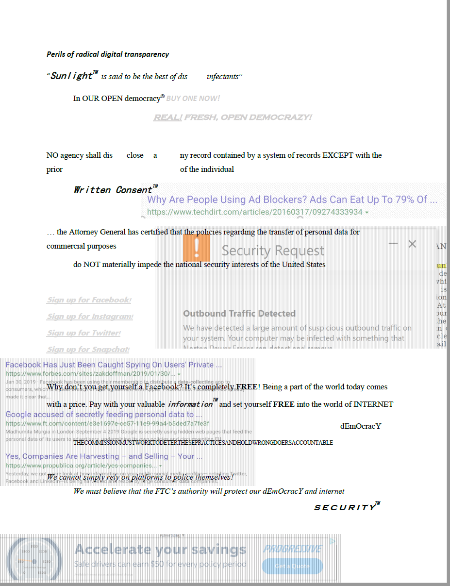
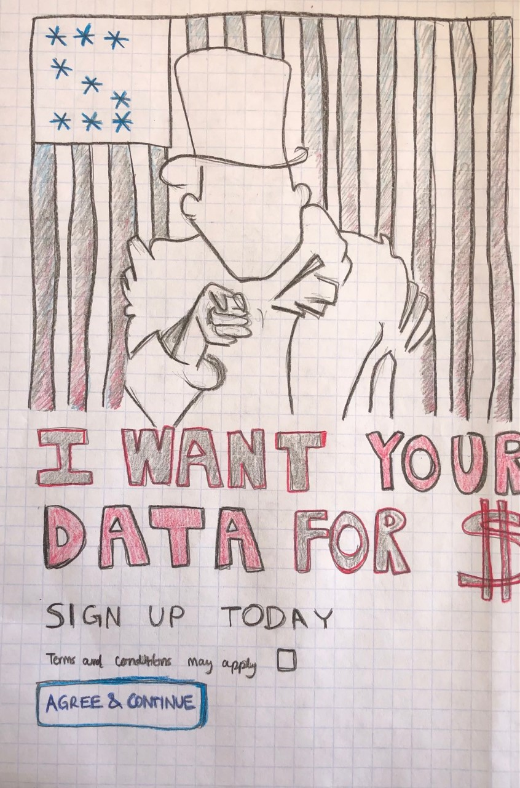

## To live in the Digital Age

To rummage for solace. To fumble for your phone in your pocket, to find it, to feel relief. To wrap your fingers around its edges, to hug it tightly within your palm. To go for a walk outside. To see someone approaching, to lower your gaze, to pull out your phone, to check the time. To hear a chime and feel a buzz. To smile at the familiar glow. To unlock the box with a swift fingerprint. To walk with both hands in your pockets, hoodie rolled up. To watch the streetlamps, turn on at night. To tilt your head up at the sky. To feel small. To point your camera up to the stars, to flash a picture. To feel cold. To warm up your hands with the heat of your phone. 

To crave a snack. To rip open a packet of Maggi Noodles. To gaze deeply into the rotating microwave plate. To eat at an empty table. To pull open a podcast on your phone. To listen to somebody, speak to an audience you cannot see. To imagine sitting next to somebody. To laugh alone. To share the last bite of noodles with yourself. To take a sip of cold water. To panic when your phone threatens to die, to frantically scramble for a charger, to jam the charger into your phone socket. To watch the screen brighten just slightly, to indicate that it is charging. To slump back into your seat, relieved. To sit with both elbows on the table and chin resting in both hands. To wait for your phone to charge back up. 

To sing to the world from your bedroom window. To mindlessly scroll through apps and trending hashtags. To blink too many times. To skip a heartbeat when a notification pops up. To put your phone down. To look up at the ceiling. To reminisce the day. To pick up your phone, again. To check the weather for tomorrow. To check if your alarms have been set. To check over your calendar. To close all remaining open apps. To close your phone, again. To close your own eyes.

--------------------------------------------------------------------------------------------------------------------------------------------------------------------------------


### Markdown

Markdown is a lightweight and easy-to-use syntax for styling your writing. It includes conventions for

```markdown
Syntax highlighted code block

# Header 1
## Header 2
### Header 3

- Bulleted
- List

1. Numbered
2. List

**Bold** and _Italic_ and `Code` text

[Link](url) and 
```

For more details see [GitHub Flavored Markdown](https://guides.github.com/features/mastering-markdown/).

### Jekyll Themes

Your Pages site will use the layout and styles from the Jekyll theme you have selected in your [repository settings](https://github.com/sunnysahni/sunnysahni.github.io/settings). The name of this theme is saved in the Jekyll `_config.yml` configuration file.

### Support or Contact

Having trouble with Pages? Check out our [documentation](https://docs.github.com/categories/github-pages-basics/) or [contact support](https://github.com/contact) and we’ll help you sort it out.
--------------------------------------------------------------------------------------------------------------------------------------------------------------------------------


